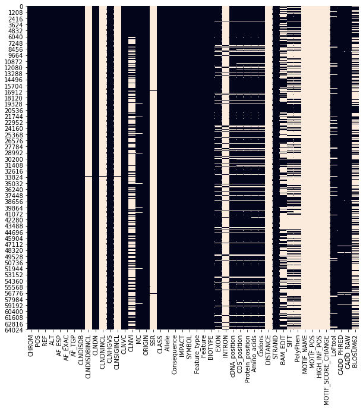

## **System stuff**


```python
import re #cleaning

#the regs
import numpy as np
import pandas as pd
import matplotlib.pyplot as plt
import seaborn as sns

#splitters
from sklearn.model_selection import train_test_split

#baseline
from sklearn.dummy import DummyClassifier

#models
from sklearn.pipeline import Pipeline
from imblearn.pipeline import Pipeline as imbpipeline
from sklearn.compose import ColumnTransformer
from category_encoders import OneHotEncoder, OrdinalEncoder
from sklearn.preprocessing import StandardScaler, LabelEncoder
from sklearn.linear_model import LogisticRegression
from sklearn.ensemble import RandomForestClassifier
from xgboost import XGBClassifier
from sklearn.model_selection import RandomizedSearchCV, StratifiedKFold
from imblearn.combine import SMOTETomek
from imblearn.over_sampling import SMOTE
from imblearn.over_sampling import SMOTENC

#looky-loos
from sklearn.metrics import roc_curve, roc_auc_score
from sklearn.metrics import classification_report
from sklearn.inspection import permutation_importance
from sklearn.metrics import accuracy_score

import warnings #banish pesky advice

warnings.filterwarnings("ignore")
pd.set_option('display.max_rows', 500)
```


```python
import sys

colab_path = '/content/drive/MyDrive/Lambda2021/U2/Project/clinvar_conflicting.csv'
local_path = '/home/prockwood/Documents/lambda2021/U2/U23/Project/clinvar_conflicting.csv'

if 'google.colab' in sys.modules:
    path = colab_path
else:
    path = local_path
```

## EDA


```python
def MissingUniqueStatistics(df): #from a kaggle EDA tutorial

  total_entry_list = []
  total_missing_value_list = []
  missing_value_ratio_list = []
  data_type_list = []
  unique_values_list = []
  number_of_unique_values_list = []
  variable_name_list = []

  for col in df.columns:

    variable_name_list.append(col)
    missing_value_ratio = round((df[col].isna().sum()/len(df[col])),4)
    total_entry_list.append(df[col].shape[0] - df[col].isna().sum())
    total_missing_value_list.append(df[col].isna().sum())
    missing_value_ratio_list.append(missing_value_ratio)
    data_type_list.append(df[col].dtype)
    unique_values_list.append(list(df[col].unique()))
    number_of_unique_values_list.append(len(df[col].unique()))

  data_info_df = pd.DataFrame({'Variable':variable_name_list,'#_Total_Entry':total_entry_list,\
                           '#_Missing_Value':total_missing_value_list,'%_Missing_Value':missing_value_ratio_list,\
                           'Data_Type':data_type_list,'Unique_Values':unique_values_list,\
                           '#_Uniques_Values':number_of_unique_values_list})

  return data_info_df.sort_values(by="#_Missing_Value",ascending=False)
```


```python
df = pd.read_csv(path)
df.shape
```


    (65188, 46)


```python
MissingUniqueStatistics(df)
```


<div>
<style scoped>
    .dataframe tbody tr th:only-of-type {
        vertical-align: middle;
    }

    .dataframe tbody tr th {
        vertical-align: top;
    }

    .dataframe thead th {
        text-align: right;
    }
</style>
<table border="1" class="dataframe">
  <thead>
    <tr style="text-align: right;">
      <th></th>
      <th>Variable</th>
      <th>#_Total_Entry</th>
      <th>#_Missing_Value</th>
      <th>%_Missing_Value</th>
      <th>Data_Type</th>
      <th>Unique_Values</th>
      <th>#_Uniques_Values</th>
    </tr>
  </thead>
  <tbody>
    <tr>
      <th>41</th>
      <td>MOTIF_SCORE_CHANGE</td>
      <td>2</td>
      <td>65186</td>
      <td>1.0000</td>
      <td>float64</td>
      <td>[nan, -0.063, -0.097]</td>
      <td>3</td>
    </tr>
    <tr>
      <th>40</th>
      <td>HIGH_INF_POS</td>
      <td>2</td>
      <td>65186</td>
      <td>1.0000</td>
      <td>object</td>
      <td>[nan, N]</td>
      <td>2</td>
    </tr>
    <tr>
      <th>39</th>
      <td>MOTIF_POS</td>
      <td>2</td>
      <td>65186</td>
      <td>1.0000</td>
      <td>float64</td>
      <td>[nan, 1.0]</td>
      <td>2</td>
    </tr>
    <tr>
      <th>38</th>
      <td>MOTIF_NAME</td>
      <td>2</td>
      <td>65186</td>
      <td>1.0000</td>
      <td>object</td>
      <td>[nan, Egr1:MA0341.1, FOXA1:MA0546.1]</td>
      <td>3</td>
    </tr>
    <tr>
      <th>33</th>
      <td>DISTANCE</td>
      <td>108</td>
      <td>65080</td>
      <td>0.9983</td>
      <td>float64</td>
      <td>[nan, 1811.0, 1855.0, 2202.0, 1651.0, 1407.0, ...</td>
      <td>97</td>
    </tr>
    <tr>
      <th>17</th>
      <td>SSR</td>
      <td>130</td>
      <td>65058</td>
      <td>0.9980</td>
      <td>float64</td>
      <td>[nan, 1.0, 16.0]</td>
      <td>3</td>
    </tr>
    <tr>
      <th>12</th>
      <td>CLNSIGINCL</td>
      <td>167</td>
      <td>65021</td>
      <td>0.9974</td>
      <td>object</td>
      <td>[nan, 424754:Likely_pathogenic, 30118:risk_fac...</td>
      <td>138</td>
    </tr>
    <tr>
      <th>8</th>
      <td>CLNDISDBINCL</td>
      <td>167</td>
      <td>65021</td>
      <td>0.9974</td>
      <td>object</td>
      <td>[nan, MedGen:C1828210,OMIM:153870,Orphanet:ORP...</td>
      <td>94</td>
    </tr>
    <tr>
      <th>10</th>
      <td>CLNDNINCL</td>
      <td>167</td>
      <td>65021</td>
      <td>0.9974</td>
      <td>object</td>
      <td>[nan, Bull's_eye_maculopathy|Methylmalonic_aci...</td>
      <td>102</td>
    </tr>
    <tr>
      <th>27</th>
      <td>INTRON</td>
      <td>8803</td>
      <td>56385</td>
      <td>0.8650</td>
      <td>object</td>
      <td>[nan, 6/27, 8/17, 3/20, 24/24, 6/38, 16/38, 20...</td>
      <td>1930</td>
    </tr>
    <tr>
      <th>37</th>
      <td>PolyPhen</td>
      <td>24796</td>
      <td>40392</td>
      <td>0.6196</td>
      <td>object</td>
      <td>[benign, probably_damaging, nan, possibly_dama...</td>
      <td>5</td>
    </tr>
    <tr>
      <th>36</th>
      <td>SIFT</td>
      <td>24836</td>
      <td>40352</td>
      <td>0.6190</td>
      <td>object</td>
      <td>[tolerated, deleterious_low_confidence, delete...</td>
      <td>5</td>
    </tr>
    <tr>
      <th>45</th>
      <td>BLOSUM62</td>
      <td>25593</td>
      <td>39595</td>
      <td>0.6074</td>
      <td>float64</td>
      <td>[2.0, -3.0, -1.0, nan, -2.0, 1.0, 3.0]</td>
      <td>7</td>
    </tr>
    <tr>
      <th>14</th>
      <td>CLNVI</td>
      <td>27659</td>
      <td>37529</td>
      <td>0.5757</td>
      <td>object</td>
      <td>[UniProtKB_(protein):Q96L58#VAR_059317, OMIM_A...</td>
      <td>27655</td>
    </tr>
    <tr>
      <th>35</th>
      <td>BAM_EDIT</td>
      <td>31969</td>
      <td>33219</td>
      <td>0.5096</td>
      <td>object</td>
      <td>[nan, OK, FAILED]</td>
      <td>3</td>
    </tr>
    <tr>
      <th>32</th>
      <td>Codons</td>
      <td>55184</td>
      <td>10004</td>
      <td>0.1535</td>
      <td>object</td>
      <td>[gaG/gaC, cCg/cTg, aTc/aCc, Ggc/Agc, Ggc/Tgc, ...</td>
      <td>2221</td>
    </tr>
    <tr>
      <th>31</th>
      <td>Amino_acids</td>
      <td>55184</td>
      <td>10004</td>
      <td>0.1535</td>
      <td>object</td>
      <td>[E/D, P/L, I/T, G/S, G/C, G/R, S/P, V/M, T/M, ...</td>
      <td>1263</td>
    </tr>
    <tr>
      <th>30</th>
      <td>Protein_position</td>
      <td>55233</td>
      <td>9955</td>
      <td>0.1527</td>
      <td>object</td>
      <td>[174, 170, 80, 34, 117, 534, 634, 1102, 1225, ...</td>
      <td>7340</td>
    </tr>
    <tr>
      <th>29</th>
      <td>CDS_position</td>
      <td>55233</td>
      <td>9955</td>
      <td>0.1527</td>
      <td>object</td>
      <td>[522, 509, 239, 100, 349, 1600, 1901, 3304, 36...</td>
      <td>13664</td>
    </tr>
    <tr>
      <th>26</th>
      <td>EXON</td>
      <td>56295</td>
      <td>8893</td>
      <td>0.1364</td>
      <td>object</td>
      <td>[1/1, 4/4, 6/12, 1/7, 9/17, 15/17, 27/30, 26/3...</td>
      <td>3265</td>
    </tr>
    <tr>
      <th>28</th>
      <td>cDNA_position</td>
      <td>56304</td>
      <td>8884</td>
      <td>0.1363</td>
      <td>object</td>
      <td>[552, 523, 632, 132, 381, 1858, 2159, 3562, 39...</td>
      <td>13971</td>
    </tr>
    <tr>
      <th>42</th>
      <td>LoFtool</td>
      <td>60975</td>
      <td>4213</td>
      <td>0.0646</td>
      <td>float64</td>
      <td>[nan, 0.101, 0.021, 0.0674, 0.183, 0.3, 0.372,...</td>
      <td>1196</td>
    </tr>
    <tr>
      <th>43</th>
      <td>CADD_PHRED</td>
      <td>64096</td>
      <td>1092</td>
      <td>0.0168</td>
      <td>float64</td>
      <td>[1.053, 31.0, 28.1, 22.5, 24.7, 23.7, 0.172, 2...</td>
      <td>9325</td>
    </tr>
    <tr>
      <th>44</th>
      <td>CADD_RAW</td>
      <td>64096</td>
      <td>1092</td>
      <td>0.0168</td>
      <td>float64</td>
      <td>[-0.208682, 6.517838, 6.061752, 3.114491, 4.76...</td>
      <td>63804</td>
    </tr>
    <tr>
      <th>15</th>
      <td>MC</td>
      <td>64342</td>
      <td>846</td>
      <td>0.0130</td>
      <td>object</td>
      <td>[SO:0001583|missense_variant, SO:0001583|misse...</td>
      <td>91</td>
    </tr>
    <tr>
      <th>22</th>
      <td>SYMBOL</td>
      <td>65172</td>
      <td>16</td>
      <td>0.0002</td>
      <td>object</td>
      <td>[B3GALT6, TMEM240, GNB1, SKI, PRDM16, NPHP4, R...</td>
      <td>2329</td>
    </tr>
    <tr>
      <th>25</th>
      <td>BIOTYPE</td>
      <td>65172</td>
      <td>16</td>
      <td>0.0002</td>
      <td>object</td>
      <td>[protein_coding, misc_RNA, nan]</td>
      <td>3</td>
    </tr>
    <tr>
      <th>34</th>
      <td>STRAND</td>
      <td>65174</td>
      <td>14</td>
      <td>0.0002</td>
      <td>float64</td>
      <td>[1.0, -1.0, nan]</td>
      <td>3</td>
    </tr>
    <tr>
      <th>23</th>
      <td>Feature_type</td>
      <td>65174</td>
      <td>14</td>
      <td>0.0002</td>
      <td>object</td>
      <td>[Transcript, MotifFeature, nan]</td>
      <td>3</td>
    </tr>
    <tr>
      <th>24</th>
      <td>Feature</td>
      <td>65174</td>
      <td>14</td>
      <td>0.0002</td>
      <td>object</td>
      <td>[NM_080605.3, NM_001114748.1, NM_002074.4, XM_...</td>
      <td>2370</td>
    </tr>
    <tr>
      <th>9</th>
      <td>CLNDN</td>
      <td>65188</td>
      <td>0</td>
      <td>0.0000</td>
      <td>object</td>
      <td>[not_specified, Spinocerebellar_ataxia_21|not_...</td>
      <td>9260</td>
    </tr>
    <tr>
      <th>2</th>
      <td>REF</td>
      <td>65188</td>
      <td>0</td>
      <td>0.0000</td>
      <td>object</td>
      <td>[G, A, T, C, CAG, GCCCTCCTCTGAGTCTTCCTCCCCTTCC...</td>
      <td>866</td>
    </tr>
    <tr>
      <th>3</th>
      <td>ALT</td>
      <td>65188</td>
      <td>0</td>
      <td>0.0000</td>
      <td>object</td>
      <td>[C, A, G, T, CT, TTCC, TA, GGCA, GA, GGAAGAA, ...</td>
      <td>458</td>
    </tr>
    <tr>
      <th>4</th>
      <td>AF_ESP</td>
      <td>65188</td>
      <td>0</td>
      <td>0.0000</td>
      <td>float64</td>
      <td>[0.0771, 0.0, 0.1523, 0.0045, 0.0019, 0.0048, ...</td>
      <td>2842</td>
    </tr>
    <tr>
      <th>5</th>
      <td>AF_EXAC</td>
      <td>65188</td>
      <td>0</td>
      <td>0.0000</td>
      <td>float64</td>
      <td>[0.1002, 0.0, 1e-05, 0.13103, 0.00357, 0.00231...</td>
      <td>6667</td>
    </tr>
    <tr>
      <th>6</th>
      <td>AF_TGP</td>
      <td>65188</td>
      <td>0</td>
      <td>0.0000</td>
      <td>float64</td>
      <td>[0.1066, 0.0, 0.106, 0.003, 0.0058, 0.001, 0.0...</td>
      <td>2087</td>
    </tr>
    <tr>
      <th>7</th>
      <td>CLNDISDB</td>
      <td>65188</td>
      <td>0</td>
      <td>0.0000</td>
      <td>object</td>
      <td>[MedGen:CN169374, MedGen:C1843891,OMIM:607454,...</td>
      <td>9234</td>
    </tr>
    <tr>
      <th>11</th>
      <td>CLNHGVS</td>
      <td>65188</td>
      <td>0</td>
      <td>0.0000</td>
      <td>object</td>
      <td>[NC_000001.10:g.1168180G&gt;C, NC_000001.10:g.147...</td>
      <td>65188</td>
    </tr>
    <tr>
      <th>1</th>
      <td>POS</td>
      <td>65188</td>
      <td>0</td>
      <td>0.0000</td>
      <td>int64</td>
      <td>[1168180, 1470752, 1737942, 2160305, 2160554, ...</td>
      <td>63115</td>
    </tr>
    <tr>
      <th>13</th>
      <td>CLNVC</td>
      <td>65188</td>
      <td>0</td>
      <td>0.0000</td>
      <td>object</td>
      <td>[single_nucleotide_variant, Deletion, Duplicat...</td>
      <td>7</td>
    </tr>
    <tr>
      <th>16</th>
      <td>ORIGIN</td>
      <td>65188</td>
      <td>0</td>
      <td>0.0000</td>
      <td>int64</td>
      <td>[1, 35, 33, 5, 37, 3, 32, 17, 41, 513, 9, 2, 5...</td>
      <td>31</td>
    </tr>
    <tr>
      <th>18</th>
      <td>CLASS</td>
      <td>65188</td>
      <td>0</td>
      <td>0.0000</td>
      <td>int64</td>
      <td>[0, 1]</td>
      <td>2</td>
    </tr>
    <tr>
      <th>19</th>
      <td>Allele</td>
      <td>65188</td>
      <td>0</td>
      <td>0.0000</td>
      <td>object</td>
      <td>[C, A, G, T, -, TCC, GCA, GAAGAA, GAA, CA, GAG...</td>
      <td>374</td>
    </tr>
    <tr>
      <th>20</th>
      <td>Consequence</td>
      <td>65188</td>
      <td>0</td>
      <td>0.0000</td>
      <td>object</td>
      <td>[missense_variant, missense_variant&amp;splice_reg...</td>
      <td>48</td>
    </tr>
    <tr>
      <th>21</th>
      <td>IMPACT</td>
      <td>65188</td>
      <td>0</td>
      <td>0.0000</td>
      <td>object</td>
      <td>[MODERATE, MODIFIER, LOW, HIGH]</td>
      <td>4</td>
    </tr>
    <tr>
      <th>0</th>
      <td>CHROM</td>
      <td>65188</td>
      <td>0</td>
      <td>0.0000</td>
      <td>object</td>
      <td>[1, 2, 3, 4, 5, 6, 7, 8, 9, 10, 11, 12, 13, 14...</td>
      <td>38</td>
    </tr>
  </tbody>
</table>
</div>


```python
df['BIOTYPE'].value_counts()
```


    protein_coding    65158
    misc_RNA             14
    Name: BIOTYPE, dtype: int64


```python
df['Feature_type']
```


    0        Transcript
    1        Transcript
    2        Transcript
    3        Transcript
    4        Transcript
                ...    
    65183    Transcript
    65184    Transcript
    65185    Transcript
    65186    Transcript
    65187    Transcript
    Name: Feature_type, Length: 65188, dtype: object


```python
df.columns[df.nunique().values == df.shape[0]] # column for which there is a unique value for every row.
```


    Index(['CLNHGVS'], dtype='object')


```python
df['CHROM'].unique() #'X' and 'MT' values, leave as object                         
```


    array(['1', '2', '3', '4', '5', '6', '7', '8', '9', '10', '11', '12',
           '13', '14', '15', '16', '17', '18', '19', '20', '21', '22', 'X',
           11, 12, 13, 14, 15, 16, 17, 18, 19, 2, 20, 21, 22, 3, 'MT'],
          dtype=object)


```python
fig = plt.figure(figsize = (10, 10))
sns.heatmap(df.isnull(), cbar = False)
```


    <matplotlib.axes._subplots.AxesSubplot at 0x7fdbc40ee280>





Some completely empty, some very sparse, intro/exon look to be inverses of each other.

Looks to be something going on with the *_positions cols too

I'm going to drop everything with nans% higher than 30


```python
# df['CHROM'].value_counts()
```

## Wrangler


```python
df = pd.read_csv(path)
df.shape
```


    (65188, 46)


```python
def wrangle(df):
    # clean and set CLNHGVS as index
    index_nums = df['CLNHGVS'].apply(lambda x: re.findall(r'\d+', x))
    df['CLNHGVS'] = np.array([lyst[2] for lyst in index_nums.values]).astype('int')
    df.set_index('CLNHGVS', inplace=True)  

    #find high-proportion-NaN columns (>.3), drop them.
    ratio_nan = (np.array([df[col].isna().sum() for col in df.columns]) / len(df)).round(3)
    ratio_nans = pd.Series(index=df.columns, data=ratio_nan)  
    high_nans = list(ratio_nans.loc[ratio_nans > 0.3].index)
    df.drop(columns=high_nans, inplace=True)

    #Drop 'cDNA_position' & 'Protein_position' : linear-dependent with 'CDS_position'
    df.drop(columns=['cDNA_position','Protein_position'], inplace=True)

#     #CDS_position is a string some observations look like 'x - x+1', split on '-' take the first #
#     #convert to int, drop CDS_position in lieu of clnCDS_pos
#     nonans = df['CDS_position'][df['CDS_position'].notnull()].str.split('-')
#     nononans = [min(pos) for pos in nonans.values]
#     clnCDS_pos = pd.DataFrame(data=nononans, index=nonans.index, columns=['clnCDS_pos']).astype('int')
#     df = pd.merge(df, clnCDS_pos, how='left', left_index=True, right_index=True)
#     df.drop(columns='CDS_position', inplace=True)

    #Find catagorical features with cardinality between 2 and 300 -> low_card_cat_cols list
    cat_cols = df.select_dtypes(include='object').columns
    low_card_cat_cols = []
    for col in cat_cols:
        cardinality = df[col].unique().shape[0]
        if (cardinality < 300) and (cardinality > 1):
            low_card_cat_cols.append(col)

    #numeric features to keep
    num_cols = df.select_dtypes(include='number').columns

    # df composed of low(ish) cardinality catagoricals and numericals
    all_cols = np.concatenate((low_card_cat_cols, num_cols))
    df = df[all_cols]

    #Convert 'CHROM' data points
    df['CHROM'][df['CHROM']=='X'] = 23
    df['CHROM'][df['CHROM']=='MT'] = 24
    df['CHROM'] = df['CHROM'].astype('int')

    df.dropna(inplace=True) ## dropping nan rows 8000 -> 5000 rows, come back if time.

    # BIOTYPE and Feature_type have only 1 value, after dropna() call,
    # Consequence is redundant with MC, CADD_PHRED is redundant with CADD_raw
    # AF_ESP and AF_TGP are redundant with AF_EXAC
    df.drop(columns = ['BIOTYPE', 'Feature_type', 'Consequence', 'CADD_PHRED', 'AF_ESP', 'AF_TGP'], inplace=True)


    return df
```


```python
df = wrangle(df)
```


```python
# split_consequence = df['Consequence'].apply(lambda x: x.split('&'))
# flat_consequences = [ item for elem in split_consequence for item in elem]
# set(flat_consequences)
```


```python
#take just the first of multiple variant types

df['MC'] = df['MC'].apply(lambda x: x.split('|')[1].split(',')[0])
```


```python
df.shape
```


    (59392, 11)


```python
fig = plt.figure(figsize = (10, 10))
sns.heatmap(df.isnull(), cbar = False)
```


    <matplotlib.axes._subplots.AxesSubplot at 0x7fdbc40ee520>


```python
MissingUniqueStatistics(df)
```


<div>
<style scoped>
    .dataframe tbody tr th:only-of-type {
        vertical-align: middle;
    }

    .dataframe tbody tr th {
        vertical-align: top;
    }

    .dataframe thead th {
        text-align: right;
    }
</style>
<table border="1" class="dataframe">
  <thead>
    <tr style="text-align: right;">
      <th></th>
      <th>Variable</th>
      <th>#_Total_Entry</th>
      <th>#_Missing_Value</th>
      <th>%_Missing_Value</th>
      <th>Data_Type</th>
      <th>Unique_Values</th>
      <th>#_Uniques_Values</th>
    </tr>
  </thead>
  <tbody>
    <tr>
      <th>0</th>
      <td>CHROM</td>
      <td>59392</td>
      <td>0</td>
      <td>0.0</td>
      <td>int64</td>
      <td>[1, 2, 3, 4, 5, 6, 7, 8, 9, 10, 11, 12, 13, 14...</td>
      <td>23</td>
    </tr>
    <tr>
      <th>1</th>
      <td>CLNVC</td>
      <td>59392</td>
      <td>0</td>
      <td>0.0</td>
      <td>object</td>
      <td>[single_nucleotide_variant, Deletion, Duplicat...</td>
      <td>7</td>
    </tr>
    <tr>
      <th>2</th>
      <td>MC</td>
      <td>59392</td>
      <td>0</td>
      <td>0.0</td>
      <td>object</td>
      <td>[missense_variant, splice_donor_variant, synon...</td>
      <td>11</td>
    </tr>
    <tr>
      <th>3</th>
      <td>IMPACT</td>
      <td>59392</td>
      <td>0</td>
      <td>0.0</td>
      <td>object</td>
      <td>[MODERATE, MODIFIER, LOW, HIGH]</td>
      <td>4</td>
    </tr>
    <tr>
      <th>4</th>
      <td>POS</td>
      <td>59392</td>
      <td>0</td>
      <td>0.0</td>
      <td>int64</td>
      <td>[3328358, 3328659, 3347452, 5925304, 5926503, ...</td>
      <td>57704</td>
    </tr>
    <tr>
      <th>5</th>
      <td>AF_EXAC</td>
      <td>59392</td>
      <td>0</td>
      <td>0.0</td>
      <td>float64</td>
      <td>[0.0, 0.13103, 0.00357, 0.00231, 0.00267, 0.00...</td>
      <td>6219</td>
    </tr>
    <tr>
      <th>6</th>
      <td>ORIGIN</td>
      <td>59392</td>
      <td>0</td>
      <td>0.0</td>
      <td>int64</td>
      <td>[1, 5, 33, 37, 3, 17, 41, 513, 9, 2, 57, 49, 4...</td>
      <td>27</td>
    </tr>
    <tr>
      <th>7</th>
      <td>CLASS</td>
      <td>59392</td>
      <td>0</td>
      <td>0.0</td>
      <td>int64</td>
      <td>[0, 1]</td>
      <td>2</td>
    </tr>
    <tr>
      <th>8</th>
      <td>STRAND</td>
      <td>59392</td>
      <td>0</td>
      <td>0.0</td>
      <td>float64</td>
      <td>[1.0, -1.0]</td>
      <td>2</td>
    </tr>
    <tr>
      <th>9</th>
      <td>LoFtool</td>
      <td>59392</td>
      <td>0</td>
      <td>0.0</td>
      <td>float64</td>
      <td>[0.101, 0.021, 0.0674, 0.183, 0.3, 0.372, 0.27...</td>
      <td>1193</td>
    </tr>
    <tr>
      <th>10</th>
      <td>CADD_RAW</td>
      <td>59392</td>
      <td>0</td>
      <td>0.0</td>
      <td>float64</td>
      <td>[-0.543433, 3.424422, 1.126629, 2.96965, 5.430...</td>
      <td>59131</td>
    </tr>
  </tbody>
</table>
</div>


## Splits


```python
target = 'CLASS'
X = df.drop(columns=target)
y = df[target]
```


```python
# 25-75. Unbalanced
y.value_counts(), y.value_counts(normalize=True)
```


    (0    44376
     1    15016
     Name: CLASS, dtype: int64,
     0    0.747171
     1    0.252829
     Name: CLASS, dtype: float64)


```python
target_dist
```


    array([0.74717134, 0.25282866])


```python
target_dist = y.value_counts(normalize=True).values
ax = sns.barplot(x=['Agreement','Disagreement'], y=target_dist)
ax.set_ylabel('proportion')
ax.set_xlabel('target')
ax.set_title('Target Distribution')
plt.show()
```


```python
# train-val split, use stratify=y kwarg to maintain class distribution
X_train, X_val, y_train, y_val = train_test_split(X, y, stratify=y, test_size=0.2, random_state=42)
```


```python
y_val.value_counts(), y_val.value_counts(normalize=True) #verify maintenance of class distribution
```


    (0    8876
     1    3003
     Name: CLASS, dtype: int64,
     0    0.747201
     1    0.252799
     Name: CLASS, dtype: float64)


```python
y_train.value_counts(), y_train.value_counts(normalize=True) #verify maintenance of class distribution
```


    (0    35500
     1    12013
     Name: CLASS, dtype: int64,
     0    0.747164
     1    0.252836
     Name: CLASS, dtype: float64)


```python
MissingUniqueStatistics(X_train)
```


<div>
<style scoped>
    .dataframe tbody tr th:only-of-type {
        vertical-align: middle;
    }

    .dataframe tbody tr th {
        vertical-align: top;
    }

    .dataframe thead th {
        text-align: right;
    }
</style>
<table border="1" class="dataframe">
  <thead>
    <tr style="text-align: right;">
      <th></th>
      <th>Variable</th>
      <th>#_Total_Entry</th>
      <th>#_Missing_Value</th>
      <th>%_Missing_Value</th>
      <th>Data_Type</th>
      <th>Unique_Values</th>
      <th>#_Uniques_Values</th>
    </tr>
  </thead>
  <tbody>
    <tr>
      <th>0</th>
      <td>CHROM</td>
      <td>47513</td>
      <td>0</td>
      <td>0.0</td>
      <td>int64</td>
      <td>[2, 1, 16, 17, 11, 19, 4, 14, 6, 20, 8, 5, 12,...</td>
      <td>23</td>
    </tr>
    <tr>
      <th>1</th>
      <td>CLNVC</td>
      <td>47513</td>
      <td>0</td>
      <td>0.0</td>
      <td>object</td>
      <td>[single_nucleotide_variant, Deletion, Duplicat...</td>
      <td>7</td>
    </tr>
    <tr>
      <th>2</th>
      <td>MC</td>
      <td>47513</td>
      <td>0</td>
      <td>0.0</td>
      <td>object</td>
      <td>[missense_variant, synonymous_variant, intron_...</td>
      <td>11</td>
    </tr>
    <tr>
      <th>3</th>
      <td>IMPACT</td>
      <td>47513</td>
      <td>0</td>
      <td>0.0</td>
      <td>object</td>
      <td>[MODERATE, LOW, HIGH, MODIFIER]</td>
      <td>4</td>
    </tr>
    <tr>
      <th>4</th>
      <td>POS</td>
      <td>47513</td>
      <td>0</td>
      <td>0.0</td>
      <td>int64</td>
      <td>[48033765, 237058770, 15833944, 63553919, 1668...</td>
      <td>46405</td>
    </tr>
    <tr>
      <th>5</th>
      <td>AF_EXAC</td>
      <td>47513</td>
      <td>0</td>
      <td>0.0</td>
      <td>float64</td>
      <td>[0.0, 5e-05, 0.00046, 0.13087, 0.02204, 0.0001...</td>
      <td>5296</td>
    </tr>
    <tr>
      <th>6</th>
      <td>ORIGIN</td>
      <td>47513</td>
      <td>0</td>
      <td>0.0</td>
      <td>int64</td>
      <td>[1, 33, 17, 5, 32, 9, 3, 49, 35, 29, 25, 41, 1...</td>
      <td>27</td>
    </tr>
    <tr>
      <th>7</th>
      <td>STRAND</td>
      <td>47513</td>
      <td>0</td>
      <td>0.0</td>
      <td>float64</td>
      <td>[1.0, -1.0]</td>
      <td>2</td>
    </tr>
    <tr>
      <th>8</th>
      <td>LoFtool</td>
      <td>47513</td>
      <td>0</td>
      <td>0.0</td>
      <td>float64</td>
      <td>[0.0212, 0.507, 0.00613, 0.224, 0.000138, 0.01...</td>
      <td>1167</td>
    </tr>
    <tr>
      <th>9</th>
      <td>CADD_RAW</td>
      <td>47513</td>
      <td>0</td>
      <td>0.0</td>
      <td>float64</td>
      <td>[1.316302, 7.727686, 1.759632, 0.23366, 10.420...</td>
      <td>47348</td>
    </tr>
  </tbody>
</table>
</div>


## Baseline


```python
from sklearn.dummy import DummyClassifier

dummy_clf = DummyClassifier(strategy='stratified')
dummy_clf.fit(X_train, y_train)
y_pred_dummy = dummy_clf.predict(y_val)
```


```python
# doing lots of ROC plots, so function to save space
def rocplot(model, rows, pos, title):
    y_pred_proba = model.predict_proba(X_val)[:, 1]
    fpr, tpr, threshold = roc_curve(y_val, y_pred_proba)

    plt.subplot(1,rows,pos)
    plt.plot(fpr, tpr)
    plt.plot([0,1], ls='--')
    plt.title(title+' ROC curve')
    plt.xlabel('False Positive Rate')
    plt.ylabel('True Positive Rate')
```


```python
f = plt.figure(figsize=(5,4))

rocplot(dummy_clf, 1, 1, 'Baseline')

plt.show()
print('Baseline ROC-AUC Score: ', roc_auc_score(y_val, y_pred_dummy))
```


    Baseline ROC-AUC Score:  0.5028835517794509


## Models

### Linear Classification: Logistic Regression


```python
cat_features = ['CHROM', 'CLNVC', 'MC', 'IMPACT']
cat_transformer = OneHotEncoder(use_cat_names=True)

num_features = ['POS', 'AF_EXAC', 'ORIGIN', 'STRAND', 'LoFtool', 'CADD_RAW']
num_transformer = StandardScaler()

preprocessor = ColumnTransformer(
    transformers=[
        ('num', num_transformer, num_features),
        ('cat', cat_transformer, cat_features)])

pipeline = imbpipeline(steps = [['preprocessor', preprocessor],
                                ['smote', SMOTE(random_state=42)],
                                ['classifier', LogisticRegression(random_state=42)]
                               ])

stratified_kfold = StratifiedKFold(n_splits=3,
#                                        shuffle=True,
#                                        random_state=42
                                  )

param_grid = {'classifier__C':[0.001, 0.01, 0.1, 1, 10, 100, 1000]}
rand_search = RandomizedSearchCV(pipeline,
                           param_grid,
                           scoring='roc_auc',
                           cv=stratified_kfold,
                           n_jobs=-1)

rand_search.fit(X_train, y_train)
```


    RandomizedSearchCV(cv=StratifiedKFold(n_splits=3, random_state=None, shuffle=False),
                       estimator=Pipeline(steps=[['preprocessor',
                                                  ColumnTransformer(transformers=[('num',
                                                                                   StandardScaler(),
                                                                                   ['POS',
                                                                                    'AF_EXAC',
                                                                                    'ORIGIN',
                                                                                    'STRAND',
                                                                                    'LoFtool',
                                                                                    'CADD_RAW']),
                                                                                  ('cat',
                                                                                   OneHotEncoder(use_cat_names=True),
                                                                                   ['CHROM',
                                                                                    'CLNVC',
                                                                                    'MC',
                                                                                    'IMPACT'])])],
                                                 ['smote', SMOTE(random_state=42)],
                                                 ['classifier',
                                                  LogisticRegression(random_state=42)]]),
                       n_jobs=-1,
                       param_distributions={'classifier__C': [0.001, 0.01, 0.1, 1,
                                                              10, 100, 1000]},
                       scoring='roc_auc')


```python
model_LR = rand_search
print(model_LR.best_params_)
print(classification_report(y_val, model_LR.predict(X_val)))

```

    {'classifier__C': 1}
                  precision    recall  f1-score   support

               0       0.86      0.31      0.46      8876
               1       0.30      0.85      0.44      3003

        accuracy                           0.45     11879
       macro avg       0.58      0.58      0.45     11879
    weighted avg       0.72      0.45      0.45     11879


### Decision Tree Ensemble: Random Forest Classifier


```python
cat_features = ['CHROM', 'CLNVC', 'MC', 'IMPACT']
cat_transformer = OrdinalEncoder()

num_features = ['POS', 'AF_EXAC', 'ORIGIN', 'STRAND', 'LoFtool', 'CADD_RAW']

preprocessor = ColumnTransformer(
    transformers=[
        ('cat', cat_transformer, cat_features),
        ('num', 'passthrough', num_features)
        ])

pipeline = imbpipeline(steps = [['preprocessor', preprocessor],
                                ['smote', SMOTE(random_state=42)],
                                ['classifier', RandomForestClassifier(random_state=42)]
                               ])

stratified_kfold = StratifiedKFold(n_splits=3)

param_grid = {
    'classifier__max_depth': range(50,100,5),
    'classifier__n_estimators': range(150,220,10),
    'classifier__min_samples_split': range(2, 10, 1)
}

rand_search = RandomizedSearchCV(pipeline,
                           param_grid,
                           scoring='roc_auc',
                           cv=stratified_kfold,
                           n_jobs=-1)

rand_search.fit(X_train, y_train)
```


    RandomizedSearchCV(cv=StratifiedKFold(n_splits=3, random_state=None, shuffle=False),
                       estimator=Pipeline(steps=[['preprocessor',
                                                  ColumnTransformer(transformers=[('cat',
                                                                                   OrdinalEncoder(),
                                                                                   ['CHROM',
                                                                                    'CLNVC',
                                                                                    'MC',
                                                                                    'IMPACT']),
                                                                                  ('num',
                                                                                   'passthrough',
                                                                                   ['POS',
                                                                                    'AF_EXAC',
                                                                                    'ORIGIN',
                                                                                    'STRAND',
                                                                                    'LoFtool',
                                                                                    'CADD_RAW'])])],
                                                 ['smote', SMOTE(random_state=42)],
                                                 ['classifier',
                                                  RandomForestClassifier(random_state=42)]]),
                       n_jobs=-1,
                       param_distributions={'classifier__max_depth': range(50, 100, 5),
                                            'classifier__min_samples_split': range(2, 10),
                                            'classifier__n_estimators': range(150, 220, 10)},
                       scoring='roc_auc')


```python
model_RF = rand_search
print(model_RF.best_params_, '\n')
print(classification_report(y_val, model_RF.predict(X_val)))
```

    {'classifier__n_estimators': 190, 'classifier__min_samples_split': 7, 'classifier__max_depth': 55}

                  precision    recall  f1-score   support

               0       0.82      0.84      0.83      8876
               1       0.50      0.46      0.48      3003

        accuracy                           0.75     11879
       macro avg       0.66      0.65      0.66     11879
    weighted avg       0.74      0.75      0.74     11879


### Decision Tree Ensemble: Gradient Boosted Random Forest Classifier


```python
cat_features = ['CHROM', 'CLNVC', 'MC', 'IMPACT']
cat_transformer = OrdinalEncoder()

num_features = ['POS', 'AF_EXAC', 'ORIGIN', 'STRAND', 'LoFtool', 'CADD_RAW']

preprocessor = ColumnTransformer(
    transformers=[
        ('cat', cat_transformer, cat_features),
        ('num', 'passthrough', num_features)
        ])

pipeline = imbpipeline(steps = [['preprocessor', preprocessor],
                                ['smote', SMOTE(random_state=42)],
                                ['classifier', XGBClassifier(n_jobs=-1, random_state=42)]
                               ])

stratified_kfold = StratifiedKFold(n_splits=3)

param_grid = {
    'classifier__n_estimators': range(8, 20),
    'classifier__max_depth': range(6, 10),
    'classifier__learning_rate': [.01, .2, .3, .4, .45, .5],
    'classifier__colsample_bytree': [.7, .8, .9, 1.0]
}

rand_search = RandomizedSearchCV(pipeline,
                           param_grid,
                           scoring='roc_auc',
                           cv=stratified_kfold,
                           n_jobs=-1)

rand_search.fit(X_train, y_train)
```

    [17:42:01] WARNING: /tmp/build/80754af9/xgboost-split_1619724447847/work/src/learner.cc:1061: Starting in XGBoost 1.3.0, the default evaluation metric used with the objective 'binary:logistic' was changed from 'error' to 'logloss'. Explicitly set eval_metric if you'd like to restore the old behavior.


    RandomizedSearchCV(cv=StratifiedKFold(n_splits=3, random_state=None, shuffle=False),
                       estimator=Pipeline(steps=[['preprocessor',
                                                  ColumnTransformer(transformers=[('cat',
                                                                                   OrdinalEncoder(),
                                                                                   ['CHROM',
                                                                                    'CLNVC',
                                                                                    'MC',
                                                                                    'IMPACT']),
                                                                                  ('num',
                                                                                   'passthrough',
                                                                                   ['POS',
                                                                                    'AF_EXAC',
                                                                                    'ORIGIN',
                                                                                    'STRAND',
                                                                                    'LoFtool',
                                                                                    'CADD_RAW'])])],
                                                 ['smote', SMOTE(random_state=42)],
                                                 ['classifier',
                                                  XGBClass...
                                                                reg_alpha=None,
                                                                reg_lambda=None,
                                                                scale_pos_weight=None,
                                                                subsample=None,
                                                                tree_method=None,
                                                                validate_parameters=None,
                                                                verbosity=None)]]),
                       n_jobs=-1,
                       param_distributions={'classifier__colsample_bytree': [0.7,
                                                                             0.8,
                                                                             0.9,
                                                                             1.0],
                                            'classifier__learning_rate': [0.01, 0.2,
                                                                          0.3, 0.4,
                                                                          0.45,
                                                                          0.5],
                                            'classifier__max_depth': range(6, 10),
                                            'classifier__n_estimators': range(8, 20)},
                       scoring='roc_auc')


```python
model_XBRF = rand_search
print(model_XBRF.best_params_, '\n')
print(classification_report(y_val, model_XBRF.predict(X_val)))
```

    {'classifier__n_estimators': 18, 'classifier__max_depth': 7, 'classifier__learning_rate': 0.45, 'classifier__colsample_bytree': 0.9}

                  precision    recall  f1-score   support

               0       0.84      0.81      0.82      8876
               1       0.48      0.53      0.50      3003

        accuracy                           0.74     11879
       macro avg       0.66      0.67      0.66     11879
    weighted avg       0.75      0.74      0.74     11879


```python
f = plt.figure(figsize=(13,4))

rocplot(model_LR.best_estimator_, 3, 1, 'LR')
rocplot(model_RF.best_estimator_, 3, 2, 'RF')
rocplot(model_XBRF.best_estimator_, 3, 3, 'XBRF')
plt.show()

print('Logistic Regression ROC-AUC score:' , roc_auc_score(y_val, model_LR.best_estimator_.predict(X_val)).round(decimals=3))
print('Random Forest ROC-AUC score:' , roc_auc_score(y_val, model_RF.best_estimator_.predict(X_val)).round(decimals=3))
print('Boosted Random Forest ROC-AUC score:' , roc_auc_score(y_val, model_XBRF.best_estimator_.predict(X_val)).round(decimals=3))
```


    Logistic Regression ROC-AUC score: 0.582
    Random Forest ROC-AUC score: 0.651
    Boosted Random Forest ROC-AUC score: 0.668


```python
y_pred_proba = model_XBRF.predict_proba(X_val)[:, 1]

fpr, tpr, thresholds = roc_curve(y_val, y_pred_proba)

roccurve_df = pd.DataFrame({
    'False Positive Rate': fpr,
    'True Positive Rate': tpr,
    'Threshold': thresholds
})

roccurve_df[((roccurve_df['False Positive Rate']*10).apply(np.floor) == 4)
             & ((roccurve_df['True Positive Rate']*10).apply(np.floor) == 8)];
#0.26 at FP ~ 0.4, TP ~ 0.8


```


<div>
<style scoped>
    .dataframe tbody tr th:only-of-type {
        vertical-align: middle;
    }

    .dataframe tbody tr th {
        vertical-align: top;
    }

    .dataframe thead th {
        text-align: right;
    }
</style>
<table border="1" class="dataframe">
  <thead>
    <tr style="text-align: right;">
      <th></th>
      <th>False Positive Rate</th>
      <th>True Positive Rate</th>
      <th>Threshold</th>
    </tr>
  </thead>
  <tbody>
    <tr>
      <th>2747</th>
      <td>0.446598</td>
      <td>0.800200</td>
      <td>0.267051</td>
    </tr>
    <tr>
      <th>2748</th>
      <td>0.446710</td>
      <td>0.800200</td>
      <td>0.267001</td>
    </tr>
    <tr>
      <th>2749</th>
      <td>0.446936</td>
      <td>0.800200</td>
      <td>0.266820</td>
    </tr>
    <tr>
      <th>2750</th>
      <td>0.447161</td>
      <td>0.800200</td>
      <td>0.266490</td>
    </tr>
    <tr>
      <th>2751</th>
      <td>0.447161</td>
      <td>0.800533</td>
      <td>0.266412</td>
    </tr>
    <tr>
      <th>2752</th>
      <td>0.447274</td>
      <td>0.800533</td>
      <td>0.266392</td>
    </tr>
    <tr>
      <th>2753</th>
      <td>0.447386</td>
      <td>0.801532</td>
      <td>0.266058</td>
    </tr>
    <tr>
      <th>2754</th>
      <td>0.447612</td>
      <td>0.801532</td>
      <td>0.266031</td>
    </tr>
    <tr>
      <th>2755</th>
      <td>0.447612</td>
      <td>0.801865</td>
      <td>0.265989</td>
    </tr>
    <tr>
      <th>2756</th>
      <td>0.447724</td>
      <td>0.802198</td>
      <td>0.265927</td>
    </tr>
    <tr>
      <th>2757</th>
      <td>0.447837</td>
      <td>0.802198</td>
      <td>0.265924</td>
    </tr>
    <tr>
      <th>2758</th>
      <td>0.447837</td>
      <td>0.802864</td>
      <td>0.265888</td>
    </tr>
    <tr>
      <th>2759</th>
      <td>0.448400</td>
      <td>0.803530</td>
      <td>0.265879</td>
    </tr>
    <tr>
      <th>2760</th>
      <td>0.448738</td>
      <td>0.803530</td>
      <td>0.265437</td>
    </tr>
    <tr>
      <th>2761</th>
      <td>0.448738</td>
      <td>0.804529</td>
      <td>0.265369</td>
    </tr>
    <tr>
      <th>2762</th>
      <td>0.449527</td>
      <td>0.804529</td>
      <td>0.264648</td>
    </tr>
    <tr>
      <th>2763</th>
      <td>0.449865</td>
      <td>0.804529</td>
      <td>0.264615</td>
    </tr>
    <tr>
      <th>2764</th>
      <td>0.450090</td>
      <td>0.804529</td>
      <td>0.264504</td>
    </tr>
    <tr>
      <th>2765</th>
      <td>0.450090</td>
      <td>0.804862</td>
      <td>0.264444</td>
    </tr>
    <tr>
      <th>2766</th>
      <td>0.450203</td>
      <td>0.805195</td>
      <td>0.264387</td>
    </tr>
    <tr>
      <th>2767</th>
      <td>0.450315</td>
      <td>0.805195</td>
      <td>0.264334</td>
    </tr>
    <tr>
      <th>2768</th>
      <td>0.450766</td>
      <td>0.805528</td>
      <td>0.264275</td>
    </tr>
    <tr>
      <th>2769</th>
      <td>0.450766</td>
      <td>0.806194</td>
      <td>0.264184</td>
    </tr>
    <tr>
      <th>2770</th>
      <td>0.450991</td>
      <td>0.806194</td>
      <td>0.263979</td>
    </tr>
    <tr>
      <th>2771</th>
      <td>0.450991</td>
      <td>0.806860</td>
      <td>0.263629</td>
    </tr>
    <tr>
      <th>2772</th>
      <td>0.451104</td>
      <td>0.807193</td>
      <td>0.263594</td>
    </tr>
    <tr>
      <th>2773</th>
      <td>0.451780</td>
      <td>0.807193</td>
      <td>0.263274</td>
    </tr>
    <tr>
      <th>2774</th>
      <td>0.452231</td>
      <td>0.807193</td>
      <td>0.263062</td>
    </tr>
    <tr>
      <th>2775</th>
      <td>0.452456</td>
      <td>0.807193</td>
      <td>0.262956</td>
    </tr>
    <tr>
      <th>2776</th>
      <td>0.452681</td>
      <td>0.807193</td>
      <td>0.262945</td>
    </tr>
    <tr>
      <th>2777</th>
      <td>0.452794</td>
      <td>0.807193</td>
      <td>0.262873</td>
    </tr>
    <tr>
      <th>2778</th>
      <td>0.452794</td>
      <td>0.807859</td>
      <td>0.262772</td>
    </tr>
    <tr>
      <th>2779</th>
      <td>0.453019</td>
      <td>0.807859</td>
      <td>0.262728</td>
    </tr>
    <tr>
      <th>2780</th>
      <td>0.453019</td>
      <td>0.808192</td>
      <td>0.262453</td>
    </tr>
    <tr>
      <th>2781</th>
      <td>0.453357</td>
      <td>0.808192</td>
      <td>0.262203</td>
    </tr>
    <tr>
      <th>2782</th>
      <td>0.453921</td>
      <td>0.808192</td>
      <td>0.261972</td>
    </tr>
    <tr>
      <th>2783</th>
      <td>0.454033</td>
      <td>0.808192</td>
      <td>0.261763</td>
    </tr>
    <tr>
      <th>2784</th>
      <td>0.454371</td>
      <td>0.808525</td>
      <td>0.261703</td>
    </tr>
    <tr>
      <th>2785</th>
      <td>0.454371</td>
      <td>0.808858</td>
      <td>0.261703</td>
    </tr>
    <tr>
      <th>2786</th>
      <td>0.454709</td>
      <td>0.808858</td>
      <td>0.261508</td>
    </tr>
    <tr>
      <th>2787</th>
      <td>0.454935</td>
      <td>0.808858</td>
      <td>0.261501</td>
    </tr>
    <tr>
      <th>2788</th>
      <td>0.454935</td>
      <td>0.809191</td>
      <td>0.261367</td>
    </tr>
    <tr>
      <th>2789</th>
      <td>0.455160</td>
      <td>0.809191</td>
      <td>0.261276</td>
    </tr>
    <tr>
      <th>2790</th>
      <td>0.455498</td>
      <td>0.809524</td>
      <td>0.261275</td>
    </tr>
    <tr>
      <th>2791</th>
      <td>0.455723</td>
      <td>0.809524</td>
      <td>0.261164</td>
    </tr>
    <tr>
      <th>2792</th>
      <td>0.455723</td>
      <td>0.809857</td>
      <td>0.261040</td>
    </tr>
    <tr>
      <th>2793</th>
      <td>0.455836</td>
      <td>0.809857</td>
      <td>0.260988</td>
    </tr>
    <tr>
      <th>2794</th>
      <td>0.455836</td>
      <td>0.810190</td>
      <td>0.260787</td>
    </tr>
    <tr>
      <th>2795</th>
      <td>0.456061</td>
      <td>0.810190</td>
      <td>0.260596</td>
    </tr>
    <tr>
      <th>2796</th>
      <td>0.456287</td>
      <td>0.810190</td>
      <td>0.260584</td>
    </tr>
    <tr>
      <th>2797</th>
      <td>0.456287</td>
      <td>0.810523</td>
      <td>0.260432</td>
    </tr>
    <tr>
      <th>2798</th>
      <td>0.456512</td>
      <td>0.810523</td>
      <td>0.260410</td>
    </tr>
    <tr>
      <th>2799</th>
      <td>0.456625</td>
      <td>0.810856</td>
      <td>0.260375</td>
    </tr>
    <tr>
      <th>2800</th>
      <td>0.456850</td>
      <td>0.810856</td>
      <td>0.260331</td>
    </tr>
    <tr>
      <th>2801</th>
      <td>0.457301</td>
      <td>0.810856</td>
      <td>0.260155</td>
    </tr>
    <tr>
      <th>2802</th>
      <td>0.457301</td>
      <td>0.811189</td>
      <td>0.260067</td>
    </tr>
    <tr>
      <th>2803</th>
      <td>0.457526</td>
      <td>0.811189</td>
      <td>0.259974</td>
    </tr>
    <tr>
      <th>2804</th>
      <td>0.457751</td>
      <td>0.811189</td>
      <td>0.259937</td>
    </tr>
    <tr>
      <th>2805</th>
      <td>0.458315</td>
      <td>0.811189</td>
      <td>0.259676</td>
    </tr>
    <tr>
      <th>2806</th>
      <td>0.458653</td>
      <td>0.811189</td>
      <td>0.259669</td>
    </tr>
    <tr>
      <th>2807</th>
      <td>0.458765</td>
      <td>0.811189</td>
      <td>0.259437</td>
    </tr>
    <tr>
      <th>2808</th>
      <td>0.458765</td>
      <td>0.811855</td>
      <td>0.259257</td>
    </tr>
    <tr>
      <th>2809</th>
      <td>0.458878</td>
      <td>0.811855</td>
      <td>0.259209</td>
    </tr>
    <tr>
      <th>2810</th>
      <td>0.459103</td>
      <td>0.812188</td>
      <td>0.259206</td>
    </tr>
    <tr>
      <th>2811</th>
      <td>0.459103</td>
      <td>0.812854</td>
      <td>0.259140</td>
    </tr>
    <tr>
      <th>2812</th>
      <td>0.459892</td>
      <td>0.812854</td>
      <td>0.258674</td>
    </tr>
    <tr>
      <th>2813</th>
      <td>0.459892</td>
      <td>0.813187</td>
      <td>0.258586</td>
    </tr>
    <tr>
      <th>2814</th>
      <td>0.460005</td>
      <td>0.813187</td>
      <td>0.258577</td>
    </tr>
    <tr>
      <th>2815</th>
      <td>0.460005</td>
      <td>0.813520</td>
      <td>0.258574</td>
    </tr>
    <tr>
      <th>2816</th>
      <td>0.460230</td>
      <td>0.813520</td>
      <td>0.258442</td>
    </tr>
    <tr>
      <th>2817</th>
      <td>0.460230</td>
      <td>0.813853</td>
      <td>0.258157</td>
    </tr>
    <tr>
      <th>2818</th>
      <td>0.460906</td>
      <td>0.813853</td>
      <td>0.257473</td>
    </tr>
    <tr>
      <th>2819</th>
      <td>0.461244</td>
      <td>0.813853</td>
      <td>0.257277</td>
    </tr>
    <tr>
      <th>2820</th>
      <td>0.461469</td>
      <td>0.813853</td>
      <td>0.257148</td>
    </tr>
    <tr>
      <th>2821</th>
      <td>0.461469</td>
      <td>0.814186</td>
      <td>0.257110</td>
    </tr>
    <tr>
      <th>2822</th>
      <td>0.462032</td>
      <td>0.814186</td>
      <td>0.256916</td>
    </tr>
    <tr>
      <th>2823</th>
      <td>0.462032</td>
      <td>0.814519</td>
      <td>0.256772</td>
    </tr>
    <tr>
      <th>2824</th>
      <td>0.462145</td>
      <td>0.814519</td>
      <td>0.256766</td>
    </tr>
    <tr>
      <th>2825</th>
      <td>0.462145</td>
      <td>0.815185</td>
      <td>0.256655</td>
    </tr>
    <tr>
      <th>2826</th>
      <td>0.463159</td>
      <td>0.815185</td>
      <td>0.255746</td>
    </tr>
    <tr>
      <th>2827</th>
      <td>0.463272</td>
      <td>0.815518</td>
      <td>0.255739</td>
    </tr>
    <tr>
      <th>2828</th>
      <td>0.463272</td>
      <td>0.815851</td>
      <td>0.255675</td>
    </tr>
    <tr>
      <th>2829</th>
      <td>0.463384</td>
      <td>0.815851</td>
      <td>0.255621</td>
    </tr>
    <tr>
      <th>2830</th>
      <td>0.463497</td>
      <td>0.816184</td>
      <td>0.255597</td>
    </tr>
    <tr>
      <th>2831</th>
      <td>0.463610</td>
      <td>0.816184</td>
      <td>0.255569</td>
    </tr>
    <tr>
      <th>2832</th>
      <td>0.463610</td>
      <td>0.816517</td>
      <td>0.255474</td>
    </tr>
    <tr>
      <th>2833</th>
      <td>0.463722</td>
      <td>0.816517</td>
      <td>0.255346</td>
    </tr>
    <tr>
      <th>2834</th>
      <td>0.463722</td>
      <td>0.816850</td>
      <td>0.255302</td>
    </tr>
    <tr>
      <th>2835</th>
      <td>0.463948</td>
      <td>0.816850</td>
      <td>0.255157</td>
    </tr>
    <tr>
      <th>2836</th>
      <td>0.464060</td>
      <td>0.817183</td>
      <td>0.255071</td>
    </tr>
    <tr>
      <th>2837</th>
      <td>0.464398</td>
      <td>0.817183</td>
      <td>0.254968</td>
    </tr>
    <tr>
      <th>2838</th>
      <td>0.464624</td>
      <td>0.817183</td>
      <td>0.254882</td>
    </tr>
    <tr>
      <th>2839</th>
      <td>0.464736</td>
      <td>0.817183</td>
      <td>0.254789</td>
    </tr>
    <tr>
      <th>2840</th>
      <td>0.464962</td>
      <td>0.817183</td>
      <td>0.254734</td>
    </tr>
    <tr>
      <th>2841</th>
      <td>0.465074</td>
      <td>0.817183</td>
      <td>0.254640</td>
    </tr>
    <tr>
      <th>2842</th>
      <td>0.465300</td>
      <td>0.817183</td>
      <td>0.254628</td>
    </tr>
    <tr>
      <th>2843</th>
      <td>0.465750</td>
      <td>0.817183</td>
      <td>0.254325</td>
    </tr>
    <tr>
      <th>2844</th>
      <td>0.465976</td>
      <td>0.817516</td>
      <td>0.254255</td>
    </tr>
    <tr>
      <th>2845</th>
      <td>0.465976</td>
      <td>0.817849</td>
      <td>0.254253</td>
    </tr>
    <tr>
      <th>2846</th>
      <td>0.466426</td>
      <td>0.817849</td>
      <td>0.253847</td>
    </tr>
    <tr>
      <th>2847</th>
      <td>0.466652</td>
      <td>0.818515</td>
      <td>0.253776</td>
    </tr>
    <tr>
      <th>2848</th>
      <td>0.466764</td>
      <td>0.818515</td>
      <td>0.253731</td>
    </tr>
    <tr>
      <th>2849</th>
      <td>0.466764</td>
      <td>0.819181</td>
      <td>0.253497</td>
    </tr>
    <tr>
      <th>2850</th>
      <td>0.466877</td>
      <td>0.819181</td>
      <td>0.253450</td>
    </tr>
    <tr>
      <th>2851</th>
      <td>0.466877</td>
      <td>0.819514</td>
      <td>0.253328</td>
    </tr>
    <tr>
      <th>2852</th>
      <td>0.467215</td>
      <td>0.819847</td>
      <td>0.253278</td>
    </tr>
    <tr>
      <th>2853</th>
      <td>0.467215</td>
      <td>0.820180</td>
      <td>0.253155</td>
    </tr>
    <tr>
      <th>2854</th>
      <td>0.467328</td>
      <td>0.820180</td>
      <td>0.253051</td>
    </tr>
    <tr>
      <th>2855</th>
      <td>0.467666</td>
      <td>0.820513</td>
      <td>0.252863</td>
    </tr>
    <tr>
      <th>2856</th>
      <td>0.467666</td>
      <td>0.820846</td>
      <td>0.252857</td>
    </tr>
    <tr>
      <th>2857</th>
      <td>0.468116</td>
      <td>0.820846</td>
      <td>0.252645</td>
    </tr>
    <tr>
      <th>2858</th>
      <td>0.468116</td>
      <td>0.821179</td>
      <td>0.252383</td>
    </tr>
    <tr>
      <th>2859</th>
      <td>0.468680</td>
      <td>0.821179</td>
      <td>0.251569</td>
    </tr>
    <tr>
      <th>2860</th>
      <td>0.469018</td>
      <td>0.821179</td>
      <td>0.251462</td>
    </tr>
    <tr>
      <th>2861</th>
      <td>0.469018</td>
      <td>0.821512</td>
      <td>0.251455</td>
    </tr>
    <tr>
      <th>2862</th>
      <td>0.469130</td>
      <td>0.821512</td>
      <td>0.251437</td>
    </tr>
    <tr>
      <th>2863</th>
      <td>0.469356</td>
      <td>0.821512</td>
      <td>0.251408</td>
    </tr>
    <tr>
      <th>2864</th>
      <td>0.469468</td>
      <td>0.821512</td>
      <td>0.251361</td>
    </tr>
    <tr>
      <th>2865</th>
      <td>0.469694</td>
      <td>0.821512</td>
      <td>0.251288</td>
    </tr>
    <tr>
      <th>2866</th>
      <td>0.469806</td>
      <td>0.821512</td>
      <td>0.251150</td>
    </tr>
    <tr>
      <th>2867</th>
      <td>0.470032</td>
      <td>0.821512</td>
      <td>0.251060</td>
    </tr>
    <tr>
      <th>2868</th>
      <td>0.470257</td>
      <td>0.821512</td>
      <td>0.251019</td>
    </tr>
    <tr>
      <th>2869</th>
      <td>0.470257</td>
      <td>0.821845</td>
      <td>0.250957</td>
    </tr>
    <tr>
      <th>2870</th>
      <td>0.470482</td>
      <td>0.822178</td>
      <td>0.250901</td>
    </tr>
    <tr>
      <th>2871</th>
      <td>0.470482</td>
      <td>0.822511</td>
      <td>0.250828</td>
    </tr>
    <tr>
      <th>2872</th>
      <td>0.470708</td>
      <td>0.822511</td>
      <td>0.250420</td>
    </tr>
    <tr>
      <th>2873</th>
      <td>0.471046</td>
      <td>0.822511</td>
      <td>0.250245</td>
    </tr>
    <tr>
      <th>2874</th>
      <td>0.471158</td>
      <td>0.822511</td>
      <td>0.250093</td>
    </tr>
    <tr>
      <th>2875</th>
      <td>0.471496</td>
      <td>0.822511</td>
      <td>0.250085</td>
    </tr>
    <tr>
      <th>2876</th>
      <td>0.471947</td>
      <td>0.822511</td>
      <td>0.249658</td>
    </tr>
    <tr>
      <th>2877</th>
      <td>0.472059</td>
      <td>0.822844</td>
      <td>0.249650</td>
    </tr>
    <tr>
      <th>2878</th>
      <td>0.472059</td>
      <td>0.823510</td>
      <td>0.249595</td>
    </tr>
    <tr>
      <th>2879</th>
      <td>0.472172</td>
      <td>0.823510</td>
      <td>0.249557</td>
    </tr>
    <tr>
      <th>2880</th>
      <td>0.472172</td>
      <td>0.823843</td>
      <td>0.249552</td>
    </tr>
    <tr>
      <th>2881</th>
      <td>0.473186</td>
      <td>0.823843</td>
      <td>0.248636</td>
    </tr>
    <tr>
      <th>2882</th>
      <td>0.473524</td>
      <td>0.823843</td>
      <td>0.248527</td>
    </tr>
    <tr>
      <th>2883</th>
      <td>0.473524</td>
      <td>0.824176</td>
      <td>0.248438</td>
    </tr>
    <tr>
      <th>2884</th>
      <td>0.473524</td>
      <td>0.824842</td>
      <td>0.248273</td>
    </tr>
    <tr>
      <th>2885</th>
      <td>0.473862</td>
      <td>0.824842</td>
      <td>0.248157</td>
    </tr>
    <tr>
      <th>2886</th>
      <td>0.474087</td>
      <td>0.824842</td>
      <td>0.248139</td>
    </tr>
    <tr>
      <th>2887</th>
      <td>0.474200</td>
      <td>0.825175</td>
      <td>0.248112</td>
    </tr>
    <tr>
      <th>2888</th>
      <td>0.474313</td>
      <td>0.825175</td>
      <td>0.248074</td>
    </tr>
    <tr>
      <th>2889</th>
      <td>0.474763</td>
      <td>0.825175</td>
      <td>0.247998</td>
    </tr>
    <tr>
      <th>2890</th>
      <td>0.474763</td>
      <td>0.825508</td>
      <td>0.247941</td>
    </tr>
    <tr>
      <th>2891</th>
      <td>0.474989</td>
      <td>0.825508</td>
      <td>0.247694</td>
    </tr>
    <tr>
      <th>2892</th>
      <td>0.475327</td>
      <td>0.825841</td>
      <td>0.247518</td>
    </tr>
    <tr>
      <th>2893</th>
      <td>0.475552</td>
      <td>0.825841</td>
      <td>0.247433</td>
    </tr>
    <tr>
      <th>2894</th>
      <td>0.475552</td>
      <td>0.826174</td>
      <td>0.247280</td>
    </tr>
    <tr>
      <th>2895</th>
      <td>0.475665</td>
      <td>0.826174</td>
      <td>0.247267</td>
    </tr>
    <tr>
      <th>2896</th>
      <td>0.475890</td>
      <td>0.826507</td>
      <td>0.247008</td>
    </tr>
    <tr>
      <th>2897</th>
      <td>0.476115</td>
      <td>0.826507</td>
      <td>0.246890</td>
    </tr>
    <tr>
      <th>2898</th>
      <td>0.476115</td>
      <td>0.826840</td>
      <td>0.246826</td>
    </tr>
    <tr>
      <th>2899</th>
      <td>0.476341</td>
      <td>0.827173</td>
      <td>0.246801</td>
    </tr>
    <tr>
      <th>2900</th>
      <td>0.476566</td>
      <td>0.827173</td>
      <td>0.246583</td>
    </tr>
    <tr>
      <th>2901</th>
      <td>0.476679</td>
      <td>0.827173</td>
      <td>0.246551</td>
    </tr>
    <tr>
      <th>2902</th>
      <td>0.477017</td>
      <td>0.827173</td>
      <td>0.246507</td>
    </tr>
    <tr>
      <th>2903</th>
      <td>0.477129</td>
      <td>0.827173</td>
      <td>0.246459</td>
    </tr>
    <tr>
      <th>2904</th>
      <td>0.477129</td>
      <td>0.827506</td>
      <td>0.246359</td>
    </tr>
    <tr>
      <th>2905</th>
      <td>0.477805</td>
      <td>0.827506</td>
      <td>0.246011</td>
    </tr>
    <tr>
      <th>2906</th>
      <td>0.477805</td>
      <td>0.827839</td>
      <td>0.245783</td>
    </tr>
    <tr>
      <th>2907</th>
      <td>0.477918</td>
      <td>0.827839</td>
      <td>0.245781</td>
    </tr>
    <tr>
      <th>2908</th>
      <td>0.477918</td>
      <td>0.828172</td>
      <td>0.245382</td>
    </tr>
    <tr>
      <th>2909</th>
      <td>0.478143</td>
      <td>0.828172</td>
      <td>0.245329</td>
    </tr>
    <tr>
      <th>2910</th>
      <td>0.478143</td>
      <td>0.828505</td>
      <td>0.245297</td>
    </tr>
    <tr>
      <th>2911</th>
      <td>0.478369</td>
      <td>0.828505</td>
      <td>0.245124</td>
    </tr>
    <tr>
      <th>2912</th>
      <td>0.478481</td>
      <td>0.828838</td>
      <td>0.245090</td>
    </tr>
    <tr>
      <th>2913</th>
      <td>0.478481</td>
      <td>0.829171</td>
      <td>0.245071</td>
    </tr>
    <tr>
      <th>2914</th>
      <td>0.478594</td>
      <td>0.829171</td>
      <td>0.244794</td>
    </tr>
    <tr>
      <th>2915</th>
      <td>0.478594</td>
      <td>0.829837</td>
      <td>0.244603</td>
    </tr>
    <tr>
      <th>2916</th>
      <td>0.478707</td>
      <td>0.829837</td>
      <td>0.244500</td>
    </tr>
    <tr>
      <th>2917</th>
      <td>0.478707</td>
      <td>0.830170</td>
      <td>0.244474</td>
    </tr>
    <tr>
      <th>2918</th>
      <td>0.478707</td>
      <td>0.830836</td>
      <td>0.244425</td>
    </tr>
    <tr>
      <th>2919</th>
      <td>0.480735</td>
      <td>0.830836</td>
      <td>0.242793</td>
    </tr>
    <tr>
      <th>2920</th>
      <td>0.480735</td>
      <td>0.831502</td>
      <td>0.242793</td>
    </tr>
    <tr>
      <th>2921</th>
      <td>0.480960</td>
      <td>0.831502</td>
      <td>0.242629</td>
    </tr>
    <tr>
      <th>2922</th>
      <td>0.480960</td>
      <td>0.831835</td>
      <td>0.242628</td>
    </tr>
    <tr>
      <th>2923</th>
      <td>0.481073</td>
      <td>0.831835</td>
      <td>0.242567</td>
    </tr>
    <tr>
      <th>2924</th>
      <td>0.481411</td>
      <td>0.831835</td>
      <td>0.242523</td>
    </tr>
    <tr>
      <th>2925</th>
      <td>0.481523</td>
      <td>0.831835</td>
      <td>0.242496</td>
    </tr>
    <tr>
      <th>2926</th>
      <td>0.481523</td>
      <td>0.832168</td>
      <td>0.242470</td>
    </tr>
    <tr>
      <th>2927</th>
      <td>0.481861</td>
      <td>0.832168</td>
      <td>0.242311</td>
    </tr>
    <tr>
      <th>2928</th>
      <td>0.481861</td>
      <td>0.832501</td>
      <td>0.242185</td>
    </tr>
    <tr>
      <th>2929</th>
      <td>0.482199</td>
      <td>0.832501</td>
      <td>0.242020</td>
    </tr>
    <tr>
      <th>2930</th>
      <td>0.482537</td>
      <td>0.832834</td>
      <td>0.241778</td>
    </tr>
    <tr>
      <th>2931</th>
      <td>0.482763</td>
      <td>0.832834</td>
      <td>0.241720</td>
    </tr>
    <tr>
      <th>2932</th>
      <td>0.482763</td>
      <td>0.833167</td>
      <td>0.241710</td>
    </tr>
    <tr>
      <th>2933</th>
      <td>0.483664</td>
      <td>0.833500</td>
      <td>0.241644</td>
    </tr>
    <tr>
      <th>2934</th>
      <td>0.484002</td>
      <td>0.833500</td>
      <td>0.241498</td>
    </tr>
    <tr>
      <th>2935</th>
      <td>0.484114</td>
      <td>0.833833</td>
      <td>0.241469</td>
    </tr>
    <tr>
      <th>2936</th>
      <td>0.484114</td>
      <td>0.834499</td>
      <td>0.241250</td>
    </tr>
    <tr>
      <th>2937</th>
      <td>0.484227</td>
      <td>0.834832</td>
      <td>0.241193</td>
    </tr>
    <tr>
      <th>2938</th>
      <td>0.484227</td>
      <td>0.835498</td>
      <td>0.241035</td>
    </tr>
    <tr>
      <th>2939</th>
      <td>0.485128</td>
      <td>0.835498</td>
      <td>0.240381</td>
    </tr>
    <tr>
      <th>2940</th>
      <td>0.485128</td>
      <td>0.835831</td>
      <td>0.240327</td>
    </tr>
    <tr>
      <th>2941</th>
      <td>0.485241</td>
      <td>0.835831</td>
      <td>0.240245</td>
    </tr>
    <tr>
      <th>2942</th>
      <td>0.485692</td>
      <td>0.835831</td>
      <td>0.240212</td>
    </tr>
    <tr>
      <th>2943</th>
      <td>0.485692</td>
      <td>0.836164</td>
      <td>0.240027</td>
    </tr>
    <tr>
      <th>2944</th>
      <td>0.485917</td>
      <td>0.836164</td>
      <td>0.239963</td>
    </tr>
    <tr>
      <th>2945</th>
      <td>0.485917</td>
      <td>0.836497</td>
      <td>0.239847</td>
    </tr>
    <tr>
      <th>2946</th>
      <td>0.486030</td>
      <td>0.836497</td>
      <td>0.239719</td>
    </tr>
    <tr>
      <th>2947</th>
      <td>0.486030</td>
      <td>0.837163</td>
      <td>0.239465</td>
    </tr>
    <tr>
      <th>2948</th>
      <td>0.486593</td>
      <td>0.837163</td>
      <td>0.239235</td>
    </tr>
    <tr>
      <th>2949</th>
      <td>0.486593</td>
      <td>0.838495</td>
      <td>0.238708</td>
    </tr>
    <tr>
      <th>2950</th>
      <td>0.486706</td>
      <td>0.838828</td>
      <td>0.238622</td>
    </tr>
    <tr>
      <th>2951</th>
      <td>0.487382</td>
      <td>0.838828</td>
      <td>0.238483</td>
    </tr>
    <tr>
      <th>2952</th>
      <td>0.487494</td>
      <td>0.839161</td>
      <td>0.238402</td>
    </tr>
    <tr>
      <th>2953</th>
      <td>0.487945</td>
      <td>0.839161</td>
      <td>0.238062</td>
    </tr>
    <tr>
      <th>2954</th>
      <td>0.487945</td>
      <td>0.839827</td>
      <td>0.238032</td>
    </tr>
    <tr>
      <th>2955</th>
      <td>0.488058</td>
      <td>0.840160</td>
      <td>0.237974</td>
    </tr>
    <tr>
      <th>2956</th>
      <td>0.488396</td>
      <td>0.840160</td>
      <td>0.237829</td>
    </tr>
    <tr>
      <th>2957</th>
      <td>0.488396</td>
      <td>0.840493</td>
      <td>0.237810</td>
    </tr>
    <tr>
      <th>2958</th>
      <td>0.488508</td>
      <td>0.840493</td>
      <td>0.237756</td>
    </tr>
    <tr>
      <th>2959</th>
      <td>0.488959</td>
      <td>0.840493</td>
      <td>0.237728</td>
    </tr>
    <tr>
      <th>2960</th>
      <td>0.489410</td>
      <td>0.840493</td>
      <td>0.237529</td>
    </tr>
    <tr>
      <th>2961</th>
      <td>0.489860</td>
      <td>0.840826</td>
      <td>0.237275</td>
    </tr>
    <tr>
      <th>2962</th>
      <td>0.490086</td>
      <td>0.840826</td>
      <td>0.236936</td>
    </tr>
    <tr>
      <th>2963</th>
      <td>0.490198</td>
      <td>0.841159</td>
      <td>0.236779</td>
    </tr>
    <tr>
      <th>2964</th>
      <td>0.490198</td>
      <td>0.841492</td>
      <td>0.236750</td>
    </tr>
    <tr>
      <th>2965</th>
      <td>0.490424</td>
      <td>0.841492</td>
      <td>0.236681</td>
    </tr>
    <tr>
      <th>2966</th>
      <td>0.490424</td>
      <td>0.841825</td>
      <td>0.236643</td>
    </tr>
    <tr>
      <th>2967</th>
      <td>0.490762</td>
      <td>0.841825</td>
      <td>0.236458</td>
    </tr>
    <tr>
      <th>2968</th>
      <td>0.491100</td>
      <td>0.841825</td>
      <td>0.236282</td>
    </tr>
    <tr>
      <th>2969</th>
      <td>0.491325</td>
      <td>0.841825</td>
      <td>0.236233</td>
    </tr>
    <tr>
      <th>2970</th>
      <td>0.491438</td>
      <td>0.841825</td>
      <td>0.236215</td>
    </tr>
    <tr>
      <th>2971</th>
      <td>0.491438</td>
      <td>0.842158</td>
      <td>0.236106</td>
    </tr>
    <tr>
      <th>2972</th>
      <td>0.492339</td>
      <td>0.842158</td>
      <td>0.235231</td>
    </tr>
    <tr>
      <th>2973</th>
      <td>0.492564</td>
      <td>0.842158</td>
      <td>0.235158</td>
    </tr>
    <tr>
      <th>2974</th>
      <td>0.492677</td>
      <td>0.842158</td>
      <td>0.235137</td>
    </tr>
    <tr>
      <th>2975</th>
      <td>0.492677</td>
      <td>0.842491</td>
      <td>0.235061</td>
    </tr>
    <tr>
      <th>2976</th>
      <td>0.492790</td>
      <td>0.842824</td>
      <td>0.234977</td>
    </tr>
    <tr>
      <th>2977</th>
      <td>0.492902</td>
      <td>0.842824</td>
      <td>0.234935</td>
    </tr>
    <tr>
      <th>2978</th>
      <td>0.493128</td>
      <td>0.842824</td>
      <td>0.234919</td>
    </tr>
    <tr>
      <th>2979</th>
      <td>0.493128</td>
      <td>0.843157</td>
      <td>0.234876</td>
    </tr>
    <tr>
      <th>2980</th>
      <td>0.493353</td>
      <td>0.843157</td>
      <td>0.234429</td>
    </tr>
    <tr>
      <th>2981</th>
      <td>0.493353</td>
      <td>0.843490</td>
      <td>0.234388</td>
    </tr>
    <tr>
      <th>2982</th>
      <td>0.493578</td>
      <td>0.843490</td>
      <td>0.234121</td>
    </tr>
    <tr>
      <th>2983</th>
      <td>0.493578</td>
      <td>0.843823</td>
      <td>0.234101</td>
    </tr>
    <tr>
      <th>2984</th>
      <td>0.493691</td>
      <td>0.844156</td>
      <td>0.234033</td>
    </tr>
    <tr>
      <th>2985</th>
      <td>0.493691</td>
      <td>0.844822</td>
      <td>0.233793</td>
    </tr>
    <tr>
      <th>2986</th>
      <td>0.494367</td>
      <td>0.844822</td>
      <td>0.233230</td>
    </tr>
    <tr>
      <th>2987</th>
      <td>0.494592</td>
      <td>0.844822</td>
      <td>0.233118</td>
    </tr>
    <tr>
      <th>2988</th>
      <td>0.494817</td>
      <td>0.844822</td>
      <td>0.233025</td>
    </tr>
    <tr>
      <th>2989</th>
      <td>0.494817</td>
      <td>0.845155</td>
      <td>0.232781</td>
    </tr>
    <tr>
      <th>2990</th>
      <td>0.495155</td>
      <td>0.845155</td>
      <td>0.232167</td>
    </tr>
    <tr>
      <th>2991</th>
      <td>0.495155</td>
      <td>0.845488</td>
      <td>0.231954</td>
    </tr>
    <tr>
      <th>2992</th>
      <td>0.495381</td>
      <td>0.845488</td>
      <td>0.231933</td>
    </tr>
    <tr>
      <th>2993</th>
      <td>0.495606</td>
      <td>0.845488</td>
      <td>0.231822</td>
    </tr>
    <tr>
      <th>2994</th>
      <td>0.495606</td>
      <td>0.845821</td>
      <td>0.231791</td>
    </tr>
    <tr>
      <th>2995</th>
      <td>0.495719</td>
      <td>0.845821</td>
      <td>0.231709</td>
    </tr>
    <tr>
      <th>2996</th>
      <td>0.495719</td>
      <td>0.846487</td>
      <td>0.231346</td>
    </tr>
    <tr>
      <th>2997</th>
      <td>0.496057</td>
      <td>0.846487</td>
      <td>0.231094</td>
    </tr>
    <tr>
      <th>2998</th>
      <td>0.496169</td>
      <td>0.846820</td>
      <td>0.231029</td>
    </tr>
    <tr>
      <th>2999</th>
      <td>0.496395</td>
      <td>0.846820</td>
      <td>0.230787</td>
    </tr>
    <tr>
      <th>3000</th>
      <td>0.496395</td>
      <td>0.847486</td>
      <td>0.230459</td>
    </tr>
    <tr>
      <th>3001</th>
      <td>0.496507</td>
      <td>0.847486</td>
      <td>0.230446</td>
    </tr>
    <tr>
      <th>3002</th>
      <td>0.496845</td>
      <td>0.847486</td>
      <td>0.230443</td>
    </tr>
    <tr>
      <th>3003</th>
      <td>0.497071</td>
      <td>0.847486</td>
      <td>0.230421</td>
    </tr>
    <tr>
      <th>3004</th>
      <td>0.497634</td>
      <td>0.847486</td>
      <td>0.230177</td>
    </tr>
    <tr>
      <th>3005</th>
      <td>0.497634</td>
      <td>0.847819</td>
      <td>0.230171</td>
    </tr>
    <tr>
      <th>3006</th>
      <td>0.497747</td>
      <td>0.847819</td>
      <td>0.230058</td>
    </tr>
    <tr>
      <th>3007</th>
      <td>0.497747</td>
      <td>0.848485</td>
      <td>0.229998</td>
    </tr>
    <tr>
      <th>3008</th>
      <td>0.498085</td>
      <td>0.848485</td>
      <td>0.229878</td>
    </tr>
    <tr>
      <th>3009</th>
      <td>0.498085</td>
      <td>0.848818</td>
      <td>0.229838</td>
    </tr>
    <tr>
      <th>3010</th>
      <td>0.498310</td>
      <td>0.848818</td>
      <td>0.229703</td>
    </tr>
    <tr>
      <th>3011</th>
      <td>0.498423</td>
      <td>0.849151</td>
      <td>0.229696</td>
    </tr>
    <tr>
      <th>3012</th>
      <td>0.498648</td>
      <td>0.849151</td>
      <td>0.229538</td>
    </tr>
    <tr>
      <th>3013</th>
      <td>0.498648</td>
      <td>0.849817</td>
      <td>0.229361</td>
    </tr>
    <tr>
      <th>3014</th>
      <td>0.498873</td>
      <td>0.849817</td>
      <td>0.229325</td>
    </tr>
    <tr>
      <th>3015</th>
      <td>0.498986</td>
      <td>0.849817</td>
      <td>0.229302</td>
    </tr>
    <tr>
      <th>3016</th>
      <td>0.499211</td>
      <td>0.849817</td>
      <td>0.229117</td>
    </tr>
    <tr>
      <th>3017</th>
      <td>0.499549</td>
      <td>0.849817</td>
      <td>0.229086</td>
    </tr>
    <tr>
      <th>3018</th>
      <td>0.499775</td>
      <td>0.849817</td>
      <td>0.229073</td>
    </tr>
  </tbody>
</table>
</div>


```python
y_pred_proba_thresh = y_pred_proba > 0.26

print(classification_report(y_val, y_pred_proba_thresh))
```

                  precision    recall  f1-score   support

               0       0.89      0.54      0.68      8876
               1       0.38      0.81      0.51      3003

        accuracy                           0.61     11879
       macro avg       0.63      0.68      0.59     11879
    weighted avg       0.76      0.61      0.63     11879


```python
# 1. Check the threshold value at which your FPR = 0.4 and TPR = 0.8 for XBRF
# 2. Use predict proba and make everything that is above your threshold to be 1 and below to be 0
```

## Feature Importance


```python
model_RF.best_estimator_.named_steps.classifier.feature_importances_
```


    array([0.16249283, 0.04911077, 0.309801  , 0.4785954 ], dtype=float32)


```python
importances =  model_XBRF.best_estimator_.named_steps.classifier.feature_importances_
feature_names = X_train.columns
feat_imp =pd.Series(data=importances,index=feature_names).sort_values()
feat_imp.plot(kind='barh')
```


    <matplotlib.axes._subplots.AxesSubplot at 0x7fdb6d05ed60>


```python
perm_imp = permutation_importance(model_XBRF,X_val,y_val,random_state=42)
permutation_importances = pd.DataFrame({'mean_imp': perm_imp['importances_mean'],
                                        'std_imp': perm_imp['importances_std']},
                                        index = X_val.columns).sort_values(by='mean_imp', ascending=False)

```


```python
permutation_importances
```


<div>
<style scoped>
    .dataframe tbody tr th:only-of-type {
        vertical-align: middle;
    }

    .dataframe tbody tr th {
        vertical-align: top;
    }

    .dataframe thead th {
        text-align: right;
    }
</style>
<table border="1" class="dataframe">
  <thead>
    <tr style="text-align: right;">
      <th></th>
      <th>mean_imp</th>
      <th>std_imp</th>
    </tr>
  </thead>
  <tbody>
    <tr>
      <th>AF_EXAC</th>
      <td>0.203721</td>
      <td>0.002377</td>
    </tr>
    <tr>
      <th>IMPACT</th>
      <td>0.045070</td>
      <td>0.002376</td>
    </tr>
    <tr>
      <th>MC</th>
      <td>0.032282</td>
      <td>0.002593</td>
    </tr>
    <tr>
      <th>LoFtool</th>
      <td>0.029746</td>
      <td>0.001149</td>
    </tr>
    <tr>
      <th>CADD_RAW</th>
      <td>0.014556</td>
      <td>0.001250</td>
    </tr>
    <tr>
      <th>POS</th>
      <td>0.012597</td>
      <td>0.001050</td>
    </tr>
    <tr>
      <th>CHROM</th>
      <td>0.011976</td>
      <td>0.001586</td>
    </tr>
    <tr>
      <th>ORIGIN</th>
      <td>0.003066</td>
      <td>0.000541</td>
    </tr>
    <tr>
      <th>CLNVC</th>
      <td>0.002981</td>
      <td>0.000177</td>
    </tr>
    <tr>
      <th>STRAND</th>
      <td>0.001115</td>
      <td>0.000347</td>
    </tr>
  </tbody>
</table>
</div>


```python
perm_order = permutation_importances[['mean_imp', 'std_imp']].sort_values(by='mean_imp', ascending=False)
```


```python
perm_imp.importances_mean.argsort()
```


    array([7, 1, 6, 0, 4, 9, 8, 2, 3, 5])


```python
label_order = permutation_importances.index[-1::-1]
```


```python
data_order = perm_imp.importances[perm_imp.importances_mean.argsort()]
```


```python
plt.boxplot(data_order.T, vert=False,
            labels=label_order)

plt.show()
```


